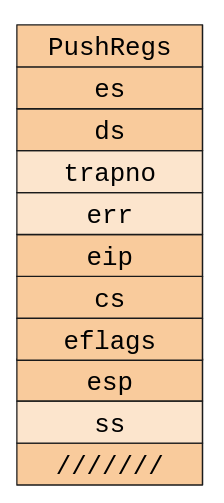

TP2: Procesos de usuario
========================

env_alloc
---------
1. ¿Qué identificadores se asignan a los primeros 5 procesos creados? (Usar base hexadecimal)


Leyendo cómo se genera el env_id tenemos el siguiente código:
```
generation = (e->env_id + (1 << ENVGENSHIFT)) & ~(NENV - 1);
if (generation <= 0)  // Don't create a negative env_id.   
	generation = 1 << ENVGENSHIFT;                     
e->env_id = generation | (e - envs);                       
```
`(e->env_id + (1 << ENVGENSHIFT)) & ~(NENV - 1)`
es igual a `0 + (0 + 4096) Y No (1023)`

`(1 << ENVGENSHIFT)` es `1000000000000`
y `NENV - 1` es `1024 - 1`, es decir `1023 = 1111111111`

`~(NENV - 1)` es la negación de lo anterior así que cambian los 1
por 0, nos quedan 10 ceros. La conjunción (Y) de 4096 y 0 nos da 0.
Es decir que terminamos en el if de `(generation <= 0)`.

Esto nos deja con `generation = 4096`.

`generation | (e - envs)` es un o entre 4096 y la posición del
env en el array de envs.

La primera vez la disyunción es entre:
```
1000000000000
0000000000000
```

que da como resultado: 1000000000000

La 2da vez es entre:
```
1000000000000
0000000000001
```
que da como resultado: 1000000000001
y así sucesivamente.

Finalmente la respuesta es: 

1) 0x1000 = 4096 (1^12)
2) 0x1001 = 4097 (1000000000001)
3) 0x1002 = 4098 (1000000000010)
4) 0x1003 = 4099 (1000000000011)
5) 0x1004 = 4100 (1000000000100)

2. Supongamos que al arrancar el kernel se lanzan NENV 
procesos a ejecución. A continuación, se destruye el proceso 
asociado a envs[630] y se lanza un proceso que cada segundo, 
muere y se vuelve a lanzar (se destruye, y se vuelve a crear). 
¿Qué identificadores tendrán esos procesos en las primeras 
cinco ejecuciones?

La primera vez es 4096 + 630 = 4726 (0x1276).
La segunda va a ser la disyunción de 4726 con 630. Es decir:

```
1001001110110
0001001110110
```
Cuyo resultado es: 1001001110110. 
Por lo tanto:

1) 0x1276 (630+4096)
2) 0x1276 (630+4096)
3) 0x1276 (630+4096)
4) 0x1276 (630+4096)
5) 0x1276 (630+4096)


env_pop_tf
----------

Antes de popal, se carga en la pila el trapframe con la instrucción:
```
movl %0,%%esp
```
En las siguientes instrucciones vemos como se van desapilando los elementos en el orden que figuran en la imagen.
Primero PushRegs (que contiene los registros edi,esi,ebp,oesp,ebx,edx,ecx,eax) con 
la instrucción popal y luego el es, el ds, y se saltea el trapno y el error code.



```
popal
popl %%es
popl %%ds
addl $0x8,%%esp /* skip tf_trapno and tf_errcode */
```

El tope de la pila, antes de llamar a iret va a contener al eip y el tercer elemento va a contener
a eflags. 


El nivel de privilegio se almacena en los últimos 2 bits del CS (code segment).
El CPU puede determinar si hubo un cambio de contexto según el contenido de esos bits. 


gdb_hello
---------

```
(qemu) info registers
EAX=003bc000 EBX=00010094 ECX=f03bc000 EDX=0000021e
ESI=00010094 EDI=00000000 EBP=f0119fd8 ESP=f0119fbc
EIP=f0102f83 EFL=00000092 [--S-A--] CPL=0 II=0 A20=1 SMM=0 HLT=0
ES =0010 00000000 ffffffff 00cf9300 DPL=0 DS   [-WA]
CS =0008 00000000 ffffffff 00cf9a00 DPL=0 CS32 [-R-]

```

```
(gdb) p tf
$1 = (struct Trapframe *) 0xf01c1000
```

```
(gdb) print sizeof(struct Trapframe) / sizeof(int)
$2 = 17
(gdb) x/17x tf
0xf01c1000:     0x00000000      0x00000000      0x00000000      0x00000000
0xf01c1010:     0x00000000      0x00000000      0x00000000      0x00000000
0xf01c1020:     0x00000023      0x00000023      0x00000000      0x00000000
0xf01c1030:     0x00800020      0x0000001b      0x00000000      0xeebfe000
0xf01c1040:     0x00000023
```

```
0xf0102f8c      488             asm volatile("\tmovl %0,%%esp\n"
(gdb) x/17x $sp
0xf01ef000:     0x00000000      0x00000000      0x00000000      0x00000000
0xf01ef010:     0x00000000      0x00000000      0x00000000      0x00000000
0xf01ef020:     0x00000023      0x00000023      0x00000000      0x00000000
0xf01ef030:     0x00800020      0x0000001b      0x00000000      0xeebfe000
0xf01ef040:     0x00000023

```
Lo primeros 8 son el contenido de PushRegs que están en 0, son los registros de uso general.

0x00000023 es ```es``` (extra segment), el segundo 0x00000023 es ```ds``` (data segment) que se cargaron en env_alloc.

0x00800020 es ```eip``` (entry point), se configura en load_icode.

0x0000001b es ```cs``` (code segment), 0xeebfe000 es ```esp``` (stack pointer) y 0x00000023 es ```ss``` (segment stack), 
que se cargaron en env_alloc.

Continuar hasta la instrucción iret, sin llegar a ejecutarla:
```
(qemu) info registers
EAX=00000000 EBX=00000000 ECX=00000000 EDX=00000000
ESI=00000000 EDI=00000000 EBP=00000000 ESP=f01ef030
EIP=f0102f92 EFL=00000096 [--S-AP-] CPL=0 II=0 A20=1 SMM=0 HLT=0
ES =0023 00000000 ffffffff 00cff300 DPL=3 DS   [-WA]
CS =0008 00000000 ffffffff 00cf9a00 DPL=0 CS32 [-R-]
```

Los cambios se producen porque se cargan los registros generales del Trapframe para luego
llamar a iret que modificará eip, eflags, cs y esp.

Ejecutar la instrucción iret: 
```
=> 0xf0102f92 <env_pop_tf+15>:  iret   
0xf0102f92      488             asm volatile("\tmovl %0,%%esp\n"
(gdb) si
=> 0x800020:    cmp    $0xeebfe000,%esp
0x00800020 in ?? ()
(gdb) p $pc
$3 = (void (*)()) 0x800020
```

```
(gdb) add-symbol-file obj/user/hello 0x800020
add symbol table from file "obj/user/hello" at
.text_addr = 0x800020
(y or n) y
Reading symbols from obj/user/hello...done.
(gdb) p $pc
$4 = (void (*)()) 0x800020 <_start>
```
Mostrar una última vez la salida de info registers:
```
(qemu) info registers
EAX=00000000 EBX=00000000 ECX=00000000 EDX=00000000
ESI=00000000 EDI=00000000 EBP=00000000 ESP=eebfe000
EIP=00800020 EFL=00000002 [-------] CPL=3 II=0 A20=1 SMM=0 HLT=0
ES =0023 00000000 ffffffff 00cff300 DPL=3 DS   [-WA]
CS =001b 00000000 ffffffff 00cffa00 DPL=3 CS32 [-R-]
```
Cambiaron EIP, EFL (eflags), CS y ESP porque iret restaura los valores de la CPU con los que encontró
en el stack.

Poner un breakpoint temporal (tbreak, se aplica una sola vez) en la función syscall() y 
explicar qué ocurre justo 
tras ejecutar la instrucción int $0x30. Usar, de ser necesario, el monitor de QEMU.
```
(qemu) info registers
EAX=00000000 EBX=00000000 ECX=0000000d EDX=eebfde88
ESI=00000000 EDI=00000000 EBP=eebfde40 ESP=efffffe8
EIP=f0103898 EFL=00000096 [--S-AP-] CPL=0 II=0 A20=1 SMM=0 HLT=0
ES =0023 00000000 ffffffff 00cff300 DPL=3 DS   [-WA]
CS =0008 00000000 ffffffff 00cf9a00 DPL=0 CS32 [-R-]
```

Lanzó una interrupción que estaba cargada en el registro %1, vemos que DPL cambió a 0 mediante
la interrupción.

kern_idt
--------

int es una instrucción en assembly que ejecuta una interrupción por software. La 14 es una interrupción
por page fault.
Al ejecutar `make run-softint-nox` devuelve:

```
...
[00000000] new env 00001000
Incoming TRAP frame at 0xefffffbc
TRAP frame at 0xf01c1000
  edi  0x00000000
  esi  0x00000000
  ebp  0xeebfdfd0
  oesp 0xefffffdc
  ebx  0x00000000
  edx  0x00000000
  ecx  0x00000000
  eax  0x00000000
  es   0x----0023
  ds   0x----0023
  trap 0x0000000d General Protection
  err  0x00000072
  eip  0x00800036
  cs   0x----001b
  flag 0x00000082
  esp  0xeebfdfd0
  ss   0x----0023
[00001000] free env 00001000
...
```
Se genera la General Protection. Esto se debe a que el código se ejecuta en el ring del usuario
y la Page Fault es una interrupción que solo puede lanzar el kernel.
Si quisiéramos cambiar esto tendríamos que cambiar la línea `SETGATE(idt[T_PGFLT], 0, GD_KT, trap_14, 0);`
por `SETGATE(idt[T_PGFLT], 0, GD_KT, trap_14, 3);`.

user_evilhello
--------------

La original llama directamente a sys_cputs con la dirección 0xf010000c casteada a (char*) mientras que
la versión del enunciado le asigna una copia del valor de lo que se encuentra en esa dirección 
y llama a sys_cputs con ese valor.

La versión original logra imprimir pocos caracteres:
```
f�rTRAP frame at 0xf01c8000
edi  0x00000000
esi  0x00000000
ebp  0xeebfdf90
oesp 0xefffffdc
ebx  0x00000000
edx  0xf010000c
ecx  0x00000064
eax  0x00000000
es   0x----0023
ds   0x----0023
trap 0x00000030 System call
err  0x00000000
eip  0x008000bd
cs   0x----001b
flag 0x00000092
esp  0xeebfdf68
ss   0x----0023
```

Mientras que la versión del enunciado tira un page fault:
```

TRAP frame at 0xf01c8000
edi  0x00000000
esi  0x00000000
ebp  0xeebfdfd0
oesp 0xefffffdc
ebx  0x00000000
edx  0x00000000
ecx  0x00000000
eax  0x00000000
es   0x----0023
ds   0x----0023
trap 0x0000000e Page Fault
cr2  0xf010000c
err  0x00000005 [user, read, protection]
eip  0x0080003d
cs   0x----001b
flag 0x00000082
esp  0xeebfdfb0
ss   0x----0023
```

Esto ocurre porque en la del enunciado se hace una desreferencia de la dirección y al ser un área de
memoria que no está mapeada para el usuario, ocurre el page fault.
En la original, no hay ninguna desreferencia ya que se llama directamente a sys_cput con la dirección
de memoria y por eso logra imprimir esos caracteres.

En la original, se accede a 0xf010000c en el ring 0 ya que al llamarse la syscall, se pasa 
a ring 0 para ejecutarse.
En la del enunciado, se accede desde el ring 3 (antes de llamar a la syscall) y por eso tira pagefault.
Es un problema porque el usuario puede acceder a memoria que no le corresponde lo que implica 
una gran falla de seguridad.

